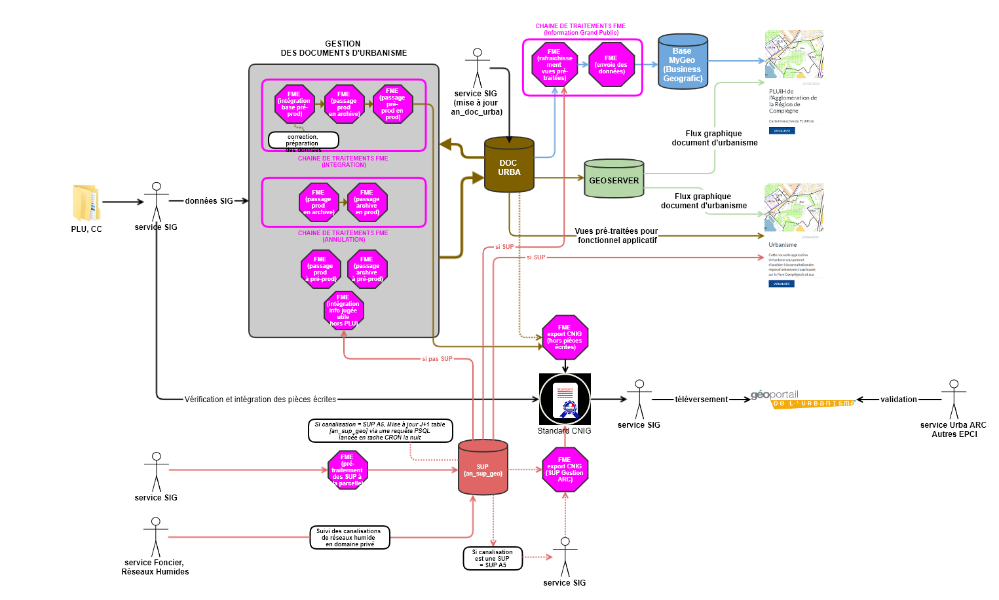
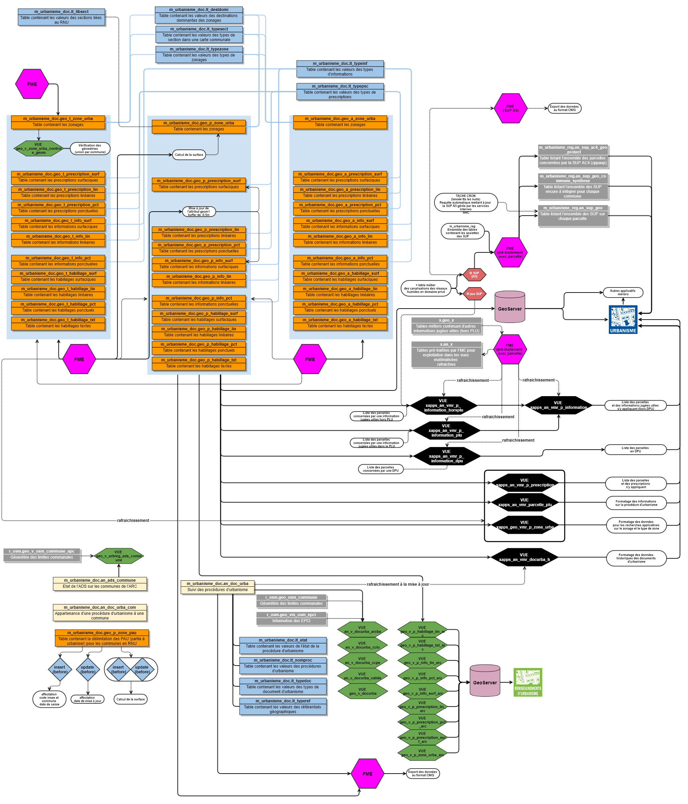
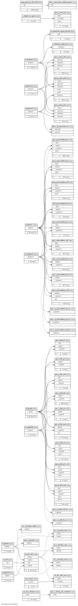

# Documentation d'administration de la base #

## Principes
  * **généralité** :
 la gestion des données des documents d'urbanisme (carte communale,PLU, PLUi et SCoT) est soumis à une norme d'échange du CNIG.
 Cette norme est implantée dans la base de données Igeo Compiègnois de l'Agglomération de la Région de Compiègne. Des ajouts spécifiques ont été réalisés comme l'ajout de champs optionnels ou de nouvelles tables de gestion. De plus, l'Agglomération a mise en oeuvre un système de versionnement afin de conserver toutes les procédures d'urbanisme. La restauration d'une ancienne procédure doit-être possible suite à l'annulation de l'actuelle.
 
 * **résumé fonctionnel** :
 le fonctionnement de la base de données répond à la norme CNIG à la fois sur les attributs et les primitives géographiques (se référer au standard http://cnig.gouv.fr/?page_id=2732). Le système de versionnement repose sur une partie production (qui contient l'ensemble des procédures en vigueur), une partie archive (qui contient l'ensemble des procédures annulée,remplacée,abrogée,...) et une partie test (qui contient l'ensemble des documents en cours de création ou de modification). Le basculement des données entre les diverses parties s'effectuent via des Workflow de l'ETL FME.

## Schéma fonctionnel (simplifié)

## Schéma fonctionnel (détaillé)

## Modèle conceptuel simplifié

## Dépendances (non critiques)

La base de données des documents d'urbanisme s'appui sur des référentiels préexistants uniquement pour les vues applicatives constituant autant de dépendances nécessaires pour l'implémentatation des vues de cette base. Il n'y a donc pas de dépendances critiques pour la gestion des données des documents d'urbanisme.

## Classes d'objets

L'ensemble des classes d'objets de gestion sont stockés dans le schéma m_urbanisme_doc et celles applicatives dans les schémas x_apps ou x_apps_public.

 ### classes d'objets de gestion :
  
   `an_ads_commune` : table des attributs sur l'état de l'ADS ARC sur les communes.
   
|Nom attribut | Définition | Type | Valeurs par défaut |
|:---|:---|:---|:---|
|insee|Code INSEE|character(5)| |
|docurba|Présence d'un document d'urbanisme (PLUi,PLU,POS,CC)|boolean| |
|ads_arc|Gestion de l'ADS par l'ARC|boolean| |
|l_rev|Information sur la révision en cours ou non du document d'urbanisme|character varying(30)| |
|l_daterev|Date de prescripiton de la révision|timestamp without time zone| |

Particularité(s) à noter :
* Une clé primaire existe sur le champ insee
---

   `an_doc_urba` : table issue du standard CNIG 2017  listant l'ensemble des procédures des documents d''urbanisme (y compris les communes en RNU)
   
|Nom attribut | Définition | Type | Valeurs par défaut |
|:---|:---|:---|:---|
|idurba|Identifiant du document d'urbanisme|character varying(30)| |
|typedoc|Type du document concerné|character varying(4)| |
|etat|Etat juridique du document|character varying(2)| |
|nomproc|Codage de la version du document concerné|character varying(10)| |
|l_nomprocn|N° d'ordre de la procédure|integer| |
|datappro|Date d'approbation|character varying(8)| |
|datefin|date de fin de validité|character varying(8)| |
|siren|Code SIREN de l'intercommunalité|character varying(9)| |
|nomreg|Nom du fichier de règlement|character varying(80)| |
|urlreg|URL ou URI du fichier du règlement|character varying(254)| |
|nomplan|Nom du fichier du plan scanné|character varying(80)| |
|urlplan|URL ou URI du fichier du plan scanné|character varying(254)| |
|urlpe|Lien d'accès à l'archive zip comprenant l'ensemble des pièces écrites|character varying(254)| |
|siteweb|Site web du service d'accès|character varying(254)| |
|typeref|Type de référentiel utilisé|character varying(2)| |
|dateref|Date du référentiel de saisie|character varying(8)| |
|l_moa_proc|Maitre d'ouvrage de la procédure|character varying(80)| |
|l_moe_proc|Maitre d'oeuvre de la procédure|character varying(80)| |
|l_moa_dmat|Maitre d'ouvrage de la dématérialisation|character varying(80)| |
|l_moe_dmat|Maitre d'oeuvre de la dématérialisation|character varying(80)| |
|l_observ|Observations|character varying(254)| |
|l_parent|Identification des documents parents pour recherche des historiques entre version de documents (1 pour le premier document (élaboration, modif, mise à jour), 2 pour la révision (révision n°1, modif, mise à jour), 3 pour le 2nd révision, ...|integer||
|l_urldgen|Lien vers le fichier PDF contenant les dispositions générales du règlement|character varying(255)| |
|l_urlann|Lien vers le fichier PDF contenant les annexes du règlement|character varying(255)| |
|l_urllex|Lien vers le fichier PDF contenant le lexique du règlement|character varying(255)| |
|nom| 	Dénomination du SCoT (SCOT uniquement)|character varying(254)| |
|rapport|Nom du fichier contenant le rapport de présentation (SCOT uniquement)|character varying(30)| |
|padd|Nom du fichier contenant le projet d'aménagement et de développement durables (SCOT uniquement)|character varying(30)| |
|doo|Nom du fichier contenant le document d'orientation et d'objectifs (SCOT uniquement)|character varying(30)| |
|urlrapport|Lien d'accès au fichier du rapport de présentation sous forme numérique (SCOT uniquement)|character varying(254)| |
|urlpadd| 	Lien d'accès au fichier du PADD|character varying(254) (SCOT uniquement)| |
|urldoo| Lien d'accès au fichier du document d'orientation et d'objectifs (SCOT uniquement)|character varying(254)| |

Particularité(s) à noter :
* Une clé primaire existe sur le champ idurba
* Une clé étrangère exsiste sur la table de valeur `lt_etat`
* Une clé étrangère exsiste sur la table de valeur `lt_nomproc`
* Une clé étrangère exsiste sur la table de valeur `lt_typedoc`
* Une clé étrangère exsiste sur la table de valeur `lt_typeref`
---

`an_doc_urba_com` : table issue du standard CNIG 2017 d'appartenance d'une commune à une procédure définie.

|Nom attribut | Définition | Type  | Valeurs par défaut |
|:---|:---|:---|:---|  
|idurba|Identifiant du document d'urbanisme|character varying(30)| |
|insee|Code insee de la commune|character varying(5)| |
|epci|Code SIREN de l'EPCI auquel appartient la commune (uniquement pour un SCoT)|character varying(9)| |

Particularité(s) à noter : aucune

---

`geo_a_habillage_lin` : (archive) Donnée géographique contenant l'habillage linéaire des documents d'urbanisme locaux (PLUi, PLU, CC) sur le modèle du standard CNIG 2017

|Nom attribut | Définition | Type  | Valeurs par défaut |
|:---|:---|:---|:---|  
|idhab|Identifiant unique de l'habillage linéaire|character varying(40)| |
|nattrac|Nature du tracé|character varying(40)| |
|couleur|Couleur de l'élément graphique, sous forme RVB (255-255-000)|character varying(11)| |
|idurba|Identifiant du document d'urbanisme|character varying(30)| |
|l_insee|Code INSEE|character varying(5)| |
|l_couleur|Couleur de l'élément graphique, sous forme HEXE (#000000)|character varying(7)| |
|geom|Géométrie de l'objet|MultiLineString,2154| |

Particularité(s) à noter : aucune

---

`geo_a_habillage_pct` : (archive) Donnée géographique contenant l'habillage ponctuel des documents d'urbanisme locaux (PLUi, PLU, CC) sur le modèle du standard CNIG 2017

|Nom attribut | Définition | Type  | Valeurs par défaut |
|:---|:---|:---|:---|  
|idhab|Identifiant unique de l'habillage ponctuel|character varying(40)| |
|nattrac|Nature du tracé|character varying(40)| |
|couleur|Couleur de l'élément graphique, sous forme RVB (255-255-000)|character varying(11)| |
|idurba|Identifiant du document d'urbanisme|character varying(30)| |
|l_insee|Code INSEE|character varying(5)| |
|l_couleur|Couleur de l'élément graphique, sous forme HEXA (#000000)|character varying(7)| |
|geom|Géométrie de l'objet|MultiPoint,2154| |

Particularité(s) à noter : aucune

---

`geo_a_habillage_surf` : (archive) Donnée géographique contenant l'habillage surfacique des documents d'urbanisme locaux (PLUi, PLU, CC) sur le modèle du standard CNIG 2017

|Nom attribut | Définition | Type  | Valeurs par défaut |
|:---|:---|:---|:---|  
|idhab|Identifiant unique de l'habillage surfacique|character varying(40)| |
|nattrac|Nature du tracé|character varying(40)| |
|couleur|Couleur de l'élément graphique, sous forme RVB (255-255-000)|character varying(11)| |
|idurba|Identifiant du document d'urbanisme|character varying(30)| |
|l_insee|Code INSEE|character varying(5)| |
|l_couleur|Couleur de l'élément graphique, sous forme HEXA (#000000)|character varying(7)| |
|geom|Géométrie de l'objet|MultiPolygon,2154| |

Particularité(s) à noter : aucune

---

`geo_a_habillage_txt` : (archive) Donnée géographique contenant l'habillage textuel des documents d'urbanisme locaux (PLUi, PLU, CC) sur le modèle du standard CNIG 2017

|Nom attribut | Définition | Type  | Valeurs par défaut |
|:---|:---|:---|:---|  
|idhab|Identifiant unique de l'habillage ponctuel|character varying(40)| |
|natecr|Nature de l'écriture|character varying(40)| |
|txt|Texte de l'écriture|character varying(80)| |
|police|Police de l'écriture|character varying(40)| |
|taille|Taille de l'écriture|integer| |
|style|Style de l'écriture|character varying(40)| |
|couleur|Couleur de l'élément graphique, sous forme RVB (255-255-000)|character varying(11)| |
|angle|Angle de l'écriture exprimé en degré, par rapport à l'horizontale, dans le sens trigonométrique|integer| |
|idurba|Identifiant du document d'urbanisme|character varying(30)| |
|l_insee|Code INSEE|character varying(5)| |
|l_couleur|Couleur de l'élément graphique, sous forme HEXA (#000000)|character varying(7)| |
|geom|Géométrie de l'objet|MultiPoint,2154| |
|gid|Identifiant unique pour l'ARC|integer|nextval('m_urbanisme_doc.geo_a_habillage_txt_gid_seq'::regclass)|

Particularité(s) à noter :
* Une clé primaire existe sur le champ gid avec une séquence d'incrémentation automatique `m_urbanisme_doc.geo_a_habillage_txt_gid_seq`

---

`geo_a_info_lin` : (archive) Donnée géographique contenant les informations linéaires des documents d'urbanisme locaux (PLUi, PLU, CC) sur le modèle du standard CNIG 2017

|Nom attribut | Définition | Type  | Valeurs par défaut |
|:---|:---|:---|:---|  
|idinf|Identifiant unique de l'information linéaire|character varying(40)| |
|libelle|Nom de l'information|character varying(254)| |
|txt|Texte étiquette|character varying(10)| |
|typeinf|Type d'information|character varying(2)| |
|stypeinf|Sous type d'information|character varying(2)| |
|nomfic|Nom du fichier|character varying(80)| |
|urlfic|URL ou URI du fichier|character varying(254)| |
|idurba|Identifiant du document d'urbanisme|character varying(30)| |
|datvalid|Date de validation (aaaammjj)|character(8)| |
|l_insee|Code INSEE|character varying(5)| |
|l_nom|Nom|character varying(80)| |
|l_dateins|Date d'instauration|character(8)| |
|l_bnfcr|Bénéficiaire|character varying(80)| |
|l_datdlg|Date de délégation|character(8)| |
|l_gen|Générateur du recul|character varying(80)| |
|l_valrecul|Valeur de recul|character varying(80)| |
|l_typrecul|Type de recul|character varying(80)| |
|l_observ|Observations|character varying(254)| |
|geom|Géométrie de l'objet|MultiLineString,2154| |

Particularité(s) à noter :
* Une clé étrangère existe sur la table de valeur `lt_typeinf` (sur les attributs code et sous-code)

---

`geo_a_info_pct` : (archive) Donnée géographique contenant les informations ponctuelles des documents d'urbanisme locaux (PLUi, PLU, CC) sur le modèle du standard CNIG 2017

|Nom attribut | Définition | Type  | Valeurs par défaut |
|:---|:---|:---|:---|  
|idinf|Identifiant unique de l'information ponctuelle|character varying(40)| |
|libelle|Nom de l'information|character varying(254)| |
|txt|Texte étiquette|character varying(10)| |
|typeinf|Type d'information|character varying(2)| |
|stypeinf|Sous type d'information|character varying(2)| |
|nomfic|Nom du fichier|character varying(80)| |
|urlfic|URL ou URI du fichier|character varying(254)| |
|idurba|Identifiant du document d'urbanisme|character varying(30)| |
|datvalid|Date de validation (aaaammjj)|character(8)| |
|l_insee|Code INSEE|character varying(5)| |
|l_nom|Nom|character varying(80)| |
|l_dateins|Date d'instauration|character(8)| |
|l_bnfcr|Bénéficiaire|character varying(80)| |
|l_datdlg|Date de délégation|character(8)| |
|l_gen|Générateur du recul|character varying(80)| |
|l_valrecul|Valeur de recul|character varying(80)| |
|l_typrecul|Type de recul|character varying(80)| |
|l_observ|Observations|character varying(254)| |
|geom|Géométrie de l'objet|MultiPoint,2154| |

Particularité(s) à noter :
* Une clé étrangère existe sur la table de valeur `lt_typeinf` (sur les attributs code et sous-code)

---

`geo_a_info_surf` : (archive) Donnée géographique contenant les informations surfaciques des documents d'urbanisme locaux (PLUi, PLU, CC) sur le modèle du standard CNIG 2017

|Nom attribut | Définition | Type  | Valeurs par défaut |
|:---|:---|:---|:---|  
|idinf|Identifiant unique de l'information surfacique|character varying(40)| |
|libelle|Nom de l'information|character varying(254)| |
|txt|Texte étiquette|character varying(10)| |
|typeinf|Type d'information|character varying(2)| |
|stypeinf|Sous type d'information|character varying(2)| |
|nomfic|Nom du fichier|character varying(80)| |
|urlfic|URL ou URI du fichier|character varying(254)| |
|idurba|Identifiant du document d'urbanisme|character varying(30)| |
|datvalid|Date de validation (aaaammjj)|character(8)| |
|l_insee|Code INSEE|character varying(5)| |
|l_nom|Nom|character varying(80)| |
|l_dateins|Date d'instauration|character(8)| |
|l_bnfcr|Bénéficiaire|character varying(80)| |
|l_datdlg|Date de délégation|character(8)| |
|l_gen|Générateur du recul|character varying(80)| |
|l_valrecul|Valeur de recul|character varying(80)| |
|l_typrecul|Type de recul|character varying(80)| |
|l_observ|Observations|character varying(254)| |
|geom|Géométrie de l'objet|MultiPolygon,2154| |
|gid|Identifiant unique spécifique à l'ARC|integer|nextval('m_urbanisme_doc.geo_a_info_surf_gid_seq'::regclass)|

Particularité(s) à noter :
* Une clé primaire existe sur le champ gid avec une séquence d'incrémentation automatique `m_urbanisme_doc.geo_a_info_surf_gid_seq`
* Une clé étrangère existe sur la table de valeur `lt_typeinf` (sur les attributs code et sous-code)

---

`geo_a_prescription_lin` : (archive) Donnée géographique contenant les prescriptions linéaires des documents d'urbanisme locaux (PLUi, PLU, CC) sur le modèle du standard CNIG 2017

|Nom attribut | Définition | Type  | Valeurs par défaut |
|:---|:---|:---|:---|  
|idpsc|Identifiant unique de prescription linéaire|character varying(40)| |
|libelle|Nom de la prescription|character varying(254)| |
|txt|Texte étiquette|character varying(10)| |
|typepsc|Type de la prescription|character varying(2)| |
|stypepsc|Sous type de la prescription|character varying(2)| |
|nomfic|Nom du fichier|character varying(80)| |
|urlfic|URL ou URI du fichier|character varying(254)| |
|idurba|Identifiant du document d'urbanisme|character varying(30)| |
|datvalid|Date de validation (aaaammjj)|character(8)| |
|l_insee|Code INSEE|character varying(5)| |
|l_nom|Nom|character varying(254)| |
|l_nature|Nature / vocation|character varying(254)| |
|l_bnfcr|Bénéficiaire|character varying(80)| |
|l_numero|Numéro|character varying(10)| |
|l_surf_txt|Superficie littérale|character varying(30)| |
|l_gen|Générateur du recul|character varying(80)| |
|l_valrecul|Valeur de recul|character varying(80)| |
|l_typrecul|Type de recul|character varying(80)| |
|l_observ|Observations|character varying(254)| |
|geom|Géométrie de l'objet|MultiLineString,2154| |

Particularité(s) à noter :
* Une clé étrangère existe sur la table de valeur `lt_typepsc` (sur les attributs code et sous-code)

---

`geo_a_prescription_pct` : (archive) Donnée géographique contenant les prescriptions ponctuelles des documents d'urbanisme locaux (PLUi, PLU, CC) sur le modèle du standard CNIG 2017

|Nom attribut | Définition | Type  | Valeurs par défaut |
|:---|:---|:---|:---|  
|idpsc|Identifiant unique de prescription ponctuelle|character varying(40)| |
|libelle|Nom de la prescription|character varying(254)| |
|txt|Texte étiquette|character varying(10)| |
|typepsc|Type de la prescription|character varying(2)| |
|stypepsc|Sous type de la prescription|character varying(2)| |
|nomfic|Nom du fichier|character varying(80)| |
|urlfic|URL ou URI du fichier|character varying(254)| |
|idurba|Identifiant du document d'urbanisme|character varying(30)| |
|datvalid|Date de validation (aaaammjj)|character(8)| |
|l_insee|Code INSEE|character varying(5)| |
|l_nom|Nom|character varying(254)| |
|l_nature|Nature / vocation|character varying(254)| |
|l_bnfcr|Bénéficiaire|character varying(80)| |
|l_numero|Numéro|character varying(10)| |
|l_surf_txt|Superficie littérale|character varying(30)| |
|l_gen|Générateur du recul|character varying(80)| |
|l_valrecul|Valeur de recul|character varying(80)| |
|l_typrecul|Type de recul|character varying(80)| |
|l_observ|Observations|character varying(254)| |
|geom|Géométrie de l'objet|MultiPoint,2154| |

Particularité(s) à noter :
* Une clé étrangère existe sur la table de valeur `lt_typepsc` (sur les attributs code et sous-code)

---

`geo_a_prescription_surf` : (archive) Donnée géographique contenant les prescriptions surfaciques des documents d'urbanisme locaux (PLUi, PLU, CC) sur le modèle du standard CNIG 2017

|Nom attribut | Définition | Type  | Valeurs par défaut |
|:---|:---|:---|:---|  
|idpsc|Identifiant unique de prescription surfacique|character varying(40)| |
|libelle|Nom de la prescription|character varying(254)| |
|txt|Texte étiquette|character varying(10)| |
|typepsc|Type de la prescription|character varying(2)| |
|stypepsc|Sous type de la prescription|character varying(2)| |
|nomfic|Nom du fichier|character varying(80)| |
|urlfic|URL ou URI du fichier|character varying(254)| |
|idurba|Identifiant du document d'urbanisme|character varying(30)| |
|datvalid|Date de validation (aaaammjj)|character(8)| |
|l_insee|Code INSEE|character varying(5)| |
|l_nom|Nom|character varying(254)| |
|l_nature|Nature / vocation|character varying(254)| |
|l_bnfcr|Bénéficiaire|character varying(80)| |
|l_numero|Numéro|character varying(10)| |
|l_surf_txt|Superficie littérale|character varying(30)| |
|l_gen|Générateur du recul|character varying(80)| |
|l_valrecul|Valeur de recul|character varying(80)| |
|l_typrecul|Type de recul|character varying(80)| |
|l_observ|Observations|character varying(254)| |
|geom|Géométrie de l'objet|MultiPolygon,2154| |
|gid|Identifiant unique spécifique à l'ARC|integer|nextval('m_urbanisme_doc.geo_a_prescription_surf_gid_seq'::regclass)|

Particularité(s) à noter :
* Une clé primaire existe sur le champ gid avec une séquence d'incrémentation automatique `m_urbanisme_doc.geo_a_prescription_surf_gid_seq`
* Une clé étrangère existe sur la table de valeur `lt_typepsc` (sur les attributs code et sous-code)

---

`geo_a_zone_urba` : (archive) Donnée géographique contenant les zonages des documents d'urbanisme locaux (PLUi, PLU, CC) sur le modèle du standard CNIG 2017

|Nom attribut | Définition | Type  | Valeurs par défaut |
|:---|:---|:---|:---|  
|idzone|Identifiant unique de zone|character varying(40)| |
|libelle|Nom court de la zone|character varying(12)| |
|libelong|Nom complet de la zone|character varying(254)| |
|typezone|Type de la zone|character varying(3)| |
|nomfic|Nom du fichier du règlement complet|character varying(80)| |
|urlfic|URL ou URI du fichier du règlement complet|character varying(254)| |
|l_nomfic|Nom du fichier du règlement de la zone|character varying(80)| |
|l_urlfic|URL ou URI du fichier du règlement de la zone|character varying(254)| |
|idurba|Identifiant du document d'urbanisme|character varying(30)| |
|datvalid|Date de validation (aaaammjj)|character varying(8)| |
|typesect|Type de secteur (uniquement pour la carte communale, ZZ correspond à non concerné)|character varying(2)|'ZZ'::character varying|
|fermreco|Secteur fermé à la reconstruction (uniquement pour la carte communale)|character varying(3)|'non'::character varying|
|l_destdomi|Vocation de la zone|character varying(2)| |
|l_insee|Code INSEE|character varying(5)| |
|l_surf_cal|Surface calculée de la zone en ha|numeric| |
|l_observ|Observations|character varying(254)| |
|geom|Géométrie de l'objet|MultiPolygon,2154| |
|gid|Identifiant unique spécifique à l'ARC|integer|nextval('m_urbanisme_doc.geo_a_zone_urba_gid_seq'::regclass)|

Particularité(s) à noter :
* Une clé primaire existe sur le champ gid avec une séquence d'incrémentation automatique `m_urbanisme_doc.geo_a_zone_urba_gid_seq`
* Une clé étrangère existe sur la table de valeur `lt_destdomi`
* Une clé étrangère existe sur la table de valeur `lt_typesect`
* Une clé étrangère existe sur la table de valeur `lt_typezone`

---

`geo_a_perimetre_scot` : (archive) Donnée géographique contenant les périmètres de SCOT (format CNIG 2018)

|Nom attribut | Définition | Type  | Valeurs par défaut |
|:---|:---|:---|:---|  
|idurba|Identifiant unique du SCOT|character varying(30)| |
|geom|Géométrie de l'objet|MultiPolygon,2154| |

Particularité(s) à noter :
* Une clé primaire existe sur le champ idurba `geo_a_perimetre_scot_pkey`

---

`geo_p_habillage_lin` : (production) Donnée géographique contenant les habillages linéaires des documents d'urbanisme locaux (PLUi, PLU, CC) issue du modèle CNIG 2017

|Nom attribut | Définition | Type  | Valeurs par défaut |
|:---|:---|:---|:---|  
|idhab|Identifiant unique de l'habillage linéaire|character varying(40)| |
|nattrac|Nature du tracé|character varying(40)| |
|couleur|Couleur de l'élément graphique, sous forme RVB (255-255-000)|character varying(11)| |
|idurba|Identifiant du document d'urbanisme|character varying(30)| |
|l_insee|Code INSEE|character varying(5)| |
|l_couleur|Couleur de l'élément graphique, sous forme HEXA (#000000)|character varying(7)| |
|geom|Géométrie de l'objet|MultiLineString,2154| |

Particularité(s) à noter :
* Une clé primaire existe sur le champ idhab
* Un index est présent sur le champ geom

---

`geo_p_habillage_pct` : (production) Donnée géographique contenant les habillages ponctuels des documents d'urbanisme locaux (PLUi, PLU, CC) issue du modèle CNIG 2017

|Nom attribut | Définition | Type  | Valeurs par défaut |
|:---|:---|:---|:---|  
|idhab|Identifiant unique de l'habillage ponctuel|character varying(40)| |
|nattrac|Nature du tracé|character varying(40)| |
|couleur|Couleur de l'élément graphique, sous forme RVB (255-255-000)|character varying(11)| |
|idurba|Identifiant du document d'urbanisme|character varying(30)| |
|l_insee|Code INSEE|character varying(5)| |
|l_couleur|Couleur de l'élément graphique, sous forme HEXA (#000000)|character varying(7)| |
|geom|Géométrie de l'objet|MultiPoint,2154| |

Particularité(s) à noter :
* Une clé primaire existe sur le champ idhab
* Un index est présent sur le champ geom

---

`geo_p_habillage_surf` : (production) Donnée géographique contenant les habillages surfaciques des documents d'urbanisme locaux (PLUi, PLU, CC) issue du modèle CNIG 2017

|Nom attribut | Définition | Type  | Valeurs par défaut |
|:---|:---|:---|:---|  
|idhab|Identifiant unique de l'habillage surfacique|character varying(40)| |
|nattrac|Nature du tracé|character varying(40)| |
|couleur|Couleur de l'élément graphique, sous forme RVB (255-255-000)|character varying(11)| |
|idurba|Identifiant du document d'urbanisme|character varying(30)| |
|l_insee|Code INSEE|character varying(5)| |
|l_couleur|Couleur de l'élément graphique, sous forme HEXA (#000000)|character varying(7)| |
|geom|Géométrie de l'objet|MultiPolygon,2154| |

Particularité(s) à noter :
* Une clé primaire existe sur le champ idhab
* Un index est présent sur le champ geom

---

`geo_p_habillage_txt` : (production) Donnée géographique contenant les habillages textuels des documents d'urbanisme locaux (PLUi, PLU, CC) issue du modèle CNIG 2017

|Nom attribut | Définition | Type  | Valeurs par défaut |
|:---|:---|:---|:---|  
|idhab|Identifiant unique de l'habillage ponctuel|character varying(40)| |
|natecr|Nature de l'écriture|character varying(40)| |
|txt|Texte de l'écriture|character varying(80)| |
|police|Police de l'écriture|character varying(40)| |
|taille|Taille de l'écriture|integer| |
|style|Style de l'écriture|character varying(40)| |
|couleur|Couleur de l'élément graphique, sous forme RVB (255-255-000)|character varying(11)| |
|angle|Angle de l'écriture exprimé en degré, par rapport à l'horizontale, dans le sens trigonométrique|integer| |
|idurba|Identifiant du document d'urbanisme|character varying(30)| |
|l_insee|Code INSEE|character varying(5)| |
|l_couleur|Couleur de l'élément graphique, sous forme HEXA (#000000)|character varying(7)| |
|geom|Géométrie de l'objet|Multipoint,2154| |

Particularité(s) à noter :
* Une clé primaire existe sur le champ idhab
* Un index est présent sur le champ geom

---

`geo_p_info_lin` : (production) Donnée géographique contenant les informations linéaires des documents d'urbanisme locaux (PLUi, PLU, CC) issue du modèle CNIG 2017

|Nom attribut | Définition | Type  | Valeurs par défaut |
|:---|:---|:---|:---|  
|idinf|Identifiant unique de l'information linéaire|character varying(40)| |
|libelle|Nom de l'information|character varying(254)| |
|txt|Texte étiquette|character varying(10)| |
|typeinf|Type d'information|character varying(2)| |
|stypeinf|Sous type d'information|character varying(2)| |
|nomfic|Nom du fichier|character varying(80)| |
|urlfic|URL ou URI du fichier|character varying(254)| |
|idurba|Identifiant du document d'urbanisme|character varying(30)| |
|datvalid|Date de validation (aaaammjj)|character(8)| |
|l_insee|Code INSEE|character varying(5)| |
|l_nom|Nom|character varying(80)| |
|l_dateins|Date d'instauration|character(8)| |
|l_bnfcr|Bénéficiaire|character varying(80)| |
|l_datdlg|Date de délégation|character(8)| |
|l_gen|Générateur du recul|character varying(80)| |
|l_valrecul|Valeur de recul|character varying(80)| |
|l_typrecul|Type de recul|character varying(80)| |
|l_observ|Observations|character varying(254)| |
|geom|Géométrie de l'objet|Multilinestring,2154| |

Particularité(s) à noter :
* Une clé primaire existe sur le champ idinf
* Une clé étrangère existe sur la table de valeur `lt_typeinf` (sur les attributs code et sous-code)
* Un index est présent sur le champ geom

---

`geo_p_info_pct` : (production) Donnée géographique contenant les informations ponctuelles des documents d'urbanisme locaux (PLUi, PLU, CC) issue du modèle CNIG 2017

|Nom attribut | Définition | Type  | Valeurs par défaut |
|:---|:---|:---|:---|  
|idinf|Identifiant unique de l'information ponctuelle|character varying(40)| |
|libelle|Nom de l'information|character varying(254)| |
|txt|Texte étiquette|character varying(10)| |
|typeinf|Type d'information|character varying(2)| |
|stypeinf|Sous type d'information|character varying(2)| |
|nomfic|Nom du fichier|character varying(80)| |
|urlfic|URL ou URI du fichier|character varying(254)| |
|idurba|Identifiant du document d'urbanisme|character varying(30)| |
|datvalid|Date de validation (aaaammjj)|character(8)| |
|l_insee|Code INSEE|character varying(5)| |
|l_nom|Nom|character varying(80)| |
|l_dateins|Date d'instauration|character(8)| |
|l_bnfcr|Bénéficiaire|character varying(80)| |
|l_datdlg|Date de délégation|character(8)| |
|l_gen|Générateur du recul|character varying(80)| |
|l_valrecul|Valeur de recul|character varying(80)| |
|l_typrecul|Type de recul|character varying(80)| |
|l_observ|Observations|character varying(254)| |
|geom|Géométrie de l'objet|Multipoint,2154| |

Particularité(s) à noter :
* Une clé primaire existe sur le champ idinf
* Une clé étrangère existe sur la table de valeur `lt_typeinf` (sur les attributs code et sous-code)
* Un index est présent sur le champ geom

---

`geo_p_info_surf` : (production) Donnée géographique contenant les informations surfaciques des documents d'urbanisme locaux (PLUi, PLU, CC) issue du modèle CNIG 2017

|Nom attribut | Définition | Type  | Valeurs par défaut |
|:---|:---|:---|:---|  
|idinf|Identifiant unique de l'information surfacique|character varying(40)| |
|libelle|Nom de l'information|character varying(254)| |
|txt|Texte étiquette|character varying(10)| |
|typeinf|Type d'information|character varying(2)| |
|stypeinf|Sous type d'information|character varying(2)| |
|nomfic|Nom du fichier|character varying(80)| |
|urlfic|URL ou URI du fichier|character varying(254)| |
|idurba|Identifiant du document d'urbanisme|character varying(30)| |
|datvalid|Date de validation (aaaammjj)|character(8)| |
|l_insee|Code INSEE|character varying(5)| |
|l_nom|Nom|character varying(80)| |
|l_dateins|Date d'instauration|character(8)| |
|l_bnfcr|Bénéficiaire|character varying(80)| |
|l_datdlg|Date de délégation|character(8)| |
|l_gen|Générateur du recul|character varying(80)| |
|l_valrecul|Valeur de recul|character varying(80)| |
|l_typrecul|Type de recul|character varying(80)| |
|l_observ|Observations|character varying(254)| |
|geom|Géométrie de l'objet|USER-DEFINED| |
|geom1|Géométrie de l'objet avec un buffer de -0.5 pour calcul de la vue an_vmr_p_information pour GEO. Champ mis à jour en automatique par un trigger à l'insertion, mise à jour du champ geom|Multipolygon,2154| |

Particularité(s) à noter :
* Une clé primaire existe sur le champ idinf
* Une clé étrangère existe sur la table de valeur `lt_typeinf` (sur les attributs code et sous-code)
* Un index est présent sur le champ geom
* Un index est présent sur le champ geom1

---

`geo_p_prescription_lin` : (production) Donnée géographique contenant les prescriptions linéaires des documents d'urbanisme locaux (PLUi, PLU, CC) issue du modèle CNIG 2017

|Nom attribut | Définition | Type  | Valeurs par défaut |
|:---|:---|:---|:---|  
|idpsc|Identifiant unique de prescription linéaire|character varying(40)| |
|libelle|Nom de la prescription|character varying(254)| |
|txt|Texte étiquette|character varying(10)| |
|typepsc|Type de la prescription|character varying(2)| |
|stypepsc|Sous type de la prescription|character varying(2)| |
|nomfic|Nom du fichier|character varying(80)| |
|urlfic|URL ou URI du fichier|character varying(254)| |
|idurba|Identifiant du document d'urbanisme|character varying(30)| |
|datvalid|Date de validation (aaaammjj)|character(8)| |
|l_insee|Code INSEE|character varying(5)| |
|l_nom|Nom|character varying(254)| |
|l_nature|Nature / vocation|character varying(254)| |
|l_bnfcr|Bénéficiaire|character varying(80)| |
|l_numero|Numéro|character varying(10)| |
|l_surf_txt|Superficie littérale|character varying(30)| |
|l_gen|Générateur du recul|character varying(80)| |
|l_valrecul|Valeur de recul|character varying(80)| |
|l_typrecul|Type de recul|character varying(80)| |
|l_observ|Observations|character varying(254)| |
|geom|Géométrie de l'objet|multilinestring,2154| |

Particularité(s) à noter :
* Une clé primaire existe sur le champ idpsc
* Une clé étrangère existe sur la table de valeur `lt_typepsc` (sur les attributs code et sous-code)

---

`geo_p_prescription_pct` : (production) Donnée géographique contenant les prescriptions ponctuelles des documents d'urbanisme locaux (PLUi, PLU, CC) issue du modèle CNIG 2017

|Nom attribut | Définition | Type  | Valeurs par défaut |
|:---|:---|:---|:---|  
|idpsc|Identifiant unique de prescription ponctuelle|character varying(40)| |
|libelle|Nom de la prescription|character varying(254)| |
|txt|Texte étiquette|character varying(10)| |
|typepsc|Type de la prescription|character varying(2)| |
|stypepsc|Sous type de la prescription|character varying(2)| |
|nomfic|Nom du fichier|character varying(80)| |
|urlfic|URL ou URI du fichier|character varying(254)| |
|idurba|Identifiant du document d'urbanisme|character varying(30)| |
|datvalid|Date de validation (aaaammjj)|character(8)| |
|l_insee|Code INSEE|character varying(5)| |
|l_nom|Nom|character varying(254)| |
|l_nature|Nature / vocation|character varying(254)| |
|l_bnfcr|Bénéficiaire|character varying(80)| |
|l_numero|Numéro|character varying(10)| |
|l_surf_txt|Superficie littérale|character varying(30)| |
|l_gen|Générateur du recul|character varying(80)| |
|l_valrecul|Valeur de recul|character varying(80)| |
|l_typrecul|Type de recul|character varying(80)| |
|l_observ|Observations|character varying(254)| |
|geom|Géométrie de l'objet|Multipoint,2154| |

Particularité(s) à noter :
* Une clé primaire existe sur le champ idpsc
* Une clé étrangère existe sur la table de valeur `lt_typepsc` (sur les attributs code et sous-code)

---

`geo_p_prescription_surf` : (production) Donnée géographique contenant les prescriptions surfaciques des documents d'urbanisme locaux (PLUi, PLU, CC) issue du modèle CNIG 2017

|Nom attribut | Définition | Type  | Valeurs par défaut |
|:---|:---|:---|:---|  
|idpsc|Identifiant unique de prescription surfacique|character varying(40)| |
|libelle|Nom de la prescription|character varying(254)| |
|txt|Texte étiquette|character varying(10)| |
|typepsc|Type de la prescription|character varying(2)| |
|stypepsc|Sous type de la prescription|character varying(2)| |
|nomfic|Nom du fichier|character varying(80)| |
|urlfic|URL ou URI du fichier|character varying(254)| |
|idurba|Identifiant du document d'urbanisme|character varying(30)| |
|datvalid|Date de validation (aaaammjj)|character(8)| |
|l_insee|Code INSEE|character varying(5)| |
|l_nom|Nom|character varying(254)| |
|l_nature|Nature / vocation|character varying(254)| |
|l_bnfcr|Bénéficiaire|character varying(80)| |
|l_numero|Numéro|character varying(10)| |
|l_surf_txt|Superficie littérale|character varying(30)| |
|l_gen|Générateur du recul|character varying(80)| |
|l_valrecul|Valeur de recul|character varying(80)| |
|l_typrecul|Type de recul|character varying(80)| |
|l_observ|Observations|character varying(254)| |
|geom|Géométrie de l'objet|Multipolygon,2154| |
|geom1|Géométrie de l'objet avec un buffer de -0.5 pour calcul de la vue an_vmr_prescription pour GEO.Champ mis à jour en automatique par un trigger à l'insertion, mise à jour du champ geom|Multipolygon,2154| |

Particularité(s) à noter :
* Une clé primaire existe sur le champ idpsc
* Une clé étrangère existe sur la table de valeur `lt_typepsc` (sur les attributs code et sous-code)

---

`geo_p_zone_pau` : Donnée géographique contenant les parties actuellement urbanisées pour les communes en RNU

|Nom attribut | Définition | Type  | Valeurs par défaut |
|:---|:---|:---|:---|  
|idpau|Identifiant géographique|integer|nextval('m_urbanisme_doc.idpau_seq'::regclass)|
|date_sai|Date de saisie des données|timestamp without time zone| |
|date_maj|Date de mise à jour|timestamp without time zone| |
|op_sai|Opérateur de saisie|character varying(50)| |
|org_sai|Organisme de saisie|character varying(100)| |
|insee|Code Insee de la commune|character varying(5)| |
|commune|Libellé de la commune|character varying(100)| |
|src_geom|Référentiel spatila utilisé pour la saisie|character varying(2)|'00'::character varying|
|sup_m2|Surface brute de l'objet en m²|double precision| |
|l_type|Type de bâti intégré à la PAU|character varying(50)| |
|l_statut|Prise en compte de la PAU (oui : en RNU, non : documents d'urbaniusme en vigieur)|boolean|true|
|geom|Champ contenant la géométrie des objets|Multipolygon,2154| |

Particularité(s) à noter :
* Une clé primaire existe sur le champ idpau
* Une clé étrangère existe sur la table de valeur `r_objet.lt_src_geom`
* Un index est présent sur le champ geom
* 4 triggers :
  * `t_t1_pau_inseecommune` : intégration du code insee et du nom de la commune avant l'insert
  * `t_t2_pau_insert_date_sai` : intégration de la date de saisie avant l'insert
  * `t_t2_pau_insert_date_maj` : intégration de la date de mise à jour avant l'insert
  * `t_t4_pau_surface` : calcul de la surface en m² avant l'insert ou la mise à jour
  
---

`geo_p_zone_urba` : (production) Donnée géographique contenant les zonages des documents d'urbanisme locaux (PLUi, PLU, CC) issue du modèle CNIG 2017

|Nom attribut | Définition | Type  | Valeurs par défaut |
|:---|:---|:---|:---|  
|idzone|Identifiant unique de zone|character varying(40)| |
|libelle|Nom court de la zone|character varying(12)| |
|libelong|Nom complet de la zone|character varying(254)| |
|typezone|Type de la zone|character varying(3)| |
|nomfic|Nom du fichier du règlement complet|character varying(80)| |
|urlfic|URL ou URI du fichier du règlement complet|character varying(254)| |
|l_nomfic|Nom du fichier du règlement de la zone|character varying(80)| |
|l_urlfic|URL ou URI du fichier du règlement de la zone|character varying(254)| |
|idurba|Identifiant du document d'urbanisme|character varying(30)| |
|datvalid|Date de validation (aaaammjj)|character varying(8)| |
|typesect|Type de secteur (uniquement pour la carte communale, ZZ correspond à non concerné)|character varying(2)|'ZZ'::character varying|
|fermreco|Secteur fermé à la reconstruction (uniquement pour la carte communale)|character varying(3)|'non'::character varying|
|l_destdomi|Vocation de la zone|character varying(2)| |
|l_insee|Code INSEE|character varying(5)| |
|l_surf_cal|Surface calculée de la zone en ha|numeric| |
|l_observ|Observations|character varying(254)| |
|geom|Géométrie de l'objet|Multipolygon,2154| |

Particularité(s) à noter :
* Une clé primaire existe sur le champ idzone
* Une clé étrangère existe sur la table de valeur `lt_destdomi`
* Une clé étrangère existe sur la table de valeur `lt_typesect`
* Une clé étrangère existe sur la table de valeur `lt_typezone`
* Un index est présent sur le champ geom
* 1 trigger :
  * `l_surf_cal` : calcul de la surface en m² avant l'insert ou la mise à jour d'une géométrie uniquement

---
`geo_p_perimetre_scot` : Donnée géographique contenant les périmètres de SCOT (format CNIG 2018)

|Nom attribut | Définition | Type  | Valeurs par défaut |
|:---|:---|:---|:---|  
|idurba|Identifiant unique du SCOT|character varying(30)| |
|geom|Géométrie de l'objet|MultiPolygon,2154| |

Particularité(s) à noter :
* Une clé primaire existe sur le champ idurba `geo_p_perimetre_scot_pkey`

---

`geo_t_habillage_lin` : (pré-production) Donnée géographique contenant les habillages linéaires des documents d'urbanisme locaux (PLUi, PLU, CC) issue du modèle CNIG 2017

|Nom attribut | Définition | Type  | Valeurs par défaut |
|:---|:---|:---|:---|  
|idhab|Identifiant unique de l'habillage linéaire|character varying(40)| |
|nattrac|Nature du tracé|character varying(40)| |
|couleur|Couleur de l'élément graphique, sous forme RVB (255-255-000)|character varying(11)| |
|idurba|Identifiant du document d'urbanisme|character varying(30)| |
|l_insee|Code INSEE|character varying(5)| |
|l_couleur|Couleur de l'élément graphique, sous forme HEXA (#000000)|character varying(7)| |
|geom|Géométrie de l'objet|Multilinestring,2154| |

Particularité(s) à noter :
* Une clé primaire existe sur le champ idhab

---

`geo_t_habillage_pct` : (pré-production) Donnée géographique contenant les habillages ponctuels des documents d'urbanisme locaux (PLUi, PLU, CC) issue du modèle CNIG 2017

|Nom attribut | Définition | Type  | Valeurs par défaut |
|:---|:---|:---|:---|  
|idhab|Identifiant unique de l'habillage ponctuel|character varying(40)| |
|nattrac|Nature du tracé|character varying(40)| |
|couleur|Couleur de l'élément graphique, sous forme RVB (255-255-000)|character varying(11)| |
|idurba|Identifiant du document d'urbanisme|character varying(30)| |
|l_insee|Code INSEE|character varying(5)| |
|l_couleur|Couleur de l'élément graphique, sous forme HEXA (#000000)|character varying(7)| |
|geom|Géométrie de l'objet|Multipoint,2154| |

Particularité(s) à noter :
* Une clé primaire existe sur le champ idhab

---

`geo_t_habillage_surf` : (pré-production) Donnée géographique contenant les habillages surfaciques des documents d'urbanisme locaux (PLUi, PLU, CC) issue du modèle CNIG 2017

|Nom attribut | Définition | Type  | Valeurs par défaut |
|:---|:---|:---|:---|  
|idhab|Identifiant unique de l'habillage surfacique|character varying(40)| |
|nattrac|Nature du tracé|character varying(40)| |
|couleur|Couleur de l'élément graphique, sous forme RVB (255-255-000)|character varying(11)| |
|idurba|Identifiant du document d'urbanisme|character varying(30)| |
|l_insee|Code INSEE|character varying(5)| |
|l_couleur|Couleur de l'élément graphique, sous forme HEXA (#000000)|character varying(7)| |
|geom|Géométrie de l'objet|Multipolygon,2154| |

Particularité(s) à noter :
* Une clé primaire existe sur le champ idhab

---

`geo_t_habillage_txt` : (pré-production) Donnée géographique contenant les habillages textuels des documents d'urbanisme locaux (PLUi, PLU, CC) issue du modèle CNIG 2017

|Nom attribut | Définition | Type  | Valeurs par défaut |
|:---|:---|:---|:---|  
|idhab|Identifiant unique de l'habillage ponctuel|character varying(40)| |
|natecr|Nature de l'écriture|character varying(40)| |
|txt|Texte de l'écriture|character varying(80)| |
|police|Police de l'écriture|character varying(40)| |
|taille|Taille de l'écriture|integer| |
|style|Style de l'écriture|character varying(40)| |
|couleur|Couleur de l'élément graphique, sous forme RVB (255-255-000)|character varying(11)| |
|angle|Angle de l'écriture exprimé en degré, par rapport à l'horizontale, dans le sens trigonométrique|integer| |
|idurba|Identifiant du document d'urbanisme|character varying(30)| |
|l_insee|Code INSEE|character varying(5)| |
|l_couleur|Couleur de l'élément graphique, sous forme HEXA (#000000)|character varying(7)| |
|geom|Géométrie de l'objet|Multipoint,2154| |

Particularité(s) à noter :
* Une clé primaire existe sur le champ idhab

---

`geo_t_info_lin` : (pré-production) Donnée géographique contenant les informations linéaires des documents d'urbanisme locaux (PLUi, PLU, CC) issue du modèle CNIG 2017

|Nom attribut | Définition | Type  | Valeurs par défaut |
|:---|:---|:---|:---|  
|idinf|Identifiant unique de l'information linéaire|character varying(40)| |
|libelle|Nom de l'information|character varying(254)| |
|txt|Texte étiquette|character varying(10)| |
|typeinf|Type d'information|character varying(2)| |
|stypeinf|Sous type d'information|character varying(2)| |
|nomfic|Nom du fichier|character varying(80)| |
|urlfic|URL ou URI du fichier|character varying(254)| |
|idurba|Identifiant du document d'urbanisme|character varying(30)| |
|datvalid|Date de validation (aaaammjj)|character(8)| |
|l_insee|Code INSEE|character varying(5)| |
|l_nom|Nom|character varying(80)| |
|l_dateins|Date d'instauration|character(8)| |
|l_bnfcr|Bénéficiaire|character varying(80)| |
|l_datdlg|Date de délégation|character(8)| |
|l_gen|Générateur du recul|character varying(80)| |
|l_valrecul|Valeur de recul|character varying(80)| |
|l_typrecul|Type de recul|character varying(80)| |
|l_observ|Observations|character varying(254)| |
|geom|Géométrie de l'objet|Multilinestring| |

Particularité(s) à noter :
* Une clé primaire existe sur le champ idinf
* Une clé étrangère existe sur la table de valeur `lt_typeinf` (sur les 2 attributs code et sous-code)

---

`geo_t_info_pct` : (pré-production) Donnée géographique contenant les informations ponctuelles des documents d'urbanisme locaux (PLUi, PLU, CC) issue du modèle CNIG 2017

|Nom attribut | Définition | Type  | Valeurs par défaut |
|:---|:---|:---|:---|  
|idinf|Identifiant unique de l'information ponctuelle|character varying(40)| |
|libelle|Nom de l'information|character varying(254)| |
|txt|Texte étiquette|character varying(10)| |
|typeinf|Type d'information|character varying(2)| |
|stypeinf|Sous type d'information|character varying(2)| |
|nomfic|Nom du fichier|character varying(80)| |
|urlfic|URL ou URI du fichier|character varying(254)| |
|idurba|Identifiant du document d'urbanisme|character varying(30)| |
|datvalid|Date de validation (aaaammjj)|character(8)| |
|l_insee|Code INSEE|character varying(5)| |
|l_nom|Nom|character varying(80)| |
|l_dateins|Date d'instauration|character(8)| |
|l_bnfcr|Bénéficiaire|character varying(80)| |
|l_datdlg|Date de délégation|character(8)| |
|l_gen|Générateur du recul|character varying(80)| |
|l_valrecul|Valeur de recul|character varying(80)| |
|l_typrecul|Type de recul|character varying(80)| |
|l_observ|Observations|character varying(254)| |
|geom|Géométrie de l'objet|Multipoint,2154| |

Particularité(s) à noter :
* Une clé primaire existe sur le champ idinf
* Une clé étrangère existe sur la table de valeur `lt_typeinf` (sur les 2 attributs code et sous-code)

---

`geo_t_info_surf` : (pré-production) Donnée géographique contenant les informations surfaciques des documents d'urbanisme locaux (PLUi, PLU, CC) issue du modèle CNIG 2017

|Nom attribut | Définition | Type  | Valeurs par défaut |
|:---|:---|:---|:---|  
|idinf|Identifiant unique de l'information surfacique|character varying(40)| |
|libelle|Nom de l'information|character varying(254)| |
|txt|Texte étiquette|character varying(10)| |
|typeinf|Type d'information|character varying(2)| |
|stypeinf|Sous type d'information|character varying(2)| |
|nomfic|Nom du fichier|character varying(80)| |
|urlfic|URL ou URI du fichier|character varying(254)| |
|idurba|Identifiant du document d'urbanisme|character varying(30)| |
|datvalid|Date de validation (aaaammjj)|character(8)| |
|l_insee|Code INSEE|character varying(5)| |
|l_nom|Nom|character varying(80)| |
|l_dateins|Date d'instauration|character(8)| |
|l_bnfcr|Bénéficiaire|character varying(80)| |
|l_datdlg|Date de délégation|character(8)| |
|l_gen|Générateur du recul|character varying(80)| |
|l_valrecul|Valeur de recul|character varying(80)| |
|l_typrecul|Type de recul|character varying(80)| |
|l_observ|Observations|character varying(254)| |
|geom|Géométrie de l'objet|Multipolygon,2154| |

Particularité(s) à noter :
* Une clé primaire existe sur le champ idinf
* Une clé étrangère existe sur la table de valeur `lt_typeinf` (sur les 2 attributs code et sous-code)

---

`geo_t_prescription_lin` : (pré-production) Donnée géographique contenant les prescriptions linéaires des documents d'urbanisme locaux (PLUi, PLU, CC) issue du modèle CNIG 2017

|Nom attribut | Définition | Type  | Valeurs par défaut |
|:---|:---|:---|:---|  
|idpsc|Identifiant unique de prescription linéaire|character varying(40)| |
|libelle|Nom de la prescription|character varying(254)| |
|txt|Texte étiquette|character varying(10)| |
|typepsc|Type de la prescription|character varying(2)| |
|stypepsc|Sous type de la prescription|character varying(2)| |
|nomfic|Nom du fichier|character varying(80)| |
|urlfic|URL ou URI du fichier|character varying(254)| |
|idurba|Identifiant du document d'urbanisme|character varying(30)| |
|datvalid|Date de validation (aaaammjj)|character(8)| |
|l_insee|Code INSEE|character varying(5)| |
|l_nom|Nom|character varying(254)| |
|l_nature|Nature / vocation|character varying(254)| |
|l_bnfcr|Bénéficiaire|character varying(80)| |
|l_numero|Numéro|character varying(10)| |
|l_surf_txt|Superficie littérale|character varying(30)| |
|l_gen|Générateur du recul|character varying(80)| |
|l_valrecul|Valeur de recul|character varying(80)| |
|l_typrecul|Type de recul|character varying(80)| |
|l_observ|Observations|character varying(254)| |
|geom|Géométrie de l'objet|Multilinestring,2154| |

Particularité(s) à noter :
* Une clé primaire existe sur le champ idpsc
* Une clé étrangère existe sur la table de valeur `lt_typepsc` (sur les 2 attributs code et sous-code)

---

`geo_t_prescription_pct` : (pré-production) Donnée géographique contenant les prescriptions ponctuelles des documents d'urbanisme locaux (PLUi, PLU, CC) issue du modèle CNIG 2017

|Nom attribut | Définition | Type  | Valeurs par défaut |
|:---|:---|:---|:---|  
|idpsc|Identifiant unique de prescription ponctuelle|character varying(40)| |
|libelle|Nom de la prescription|character varying(254)| |
|txt|Texte étiquette|character varying(10)| |
|typepsc|Type de la prescription|character varying(2)| |
|stypepsc|Sous type de la prescription|character varying(2)| |
|nomfic|Nom du fichier|character varying(80)| |
|urlfic|URL ou URI du fichier|character varying(254)| |
|idurba|Identifiant du document d'urbanisme|character varying(30)| |
|datvalid|Date de validation (aaaammjj)|character(8)| |
|l_insee|Code INSEE|character varying(5)| |
|l_nom|Nom|character varying(254)| |
|l_nature|Nature / vocation|character varying(254)| |
|l_bnfcr|Bénéficiaire|character varying(80)| |
|l_numero|Numéro|character varying(10)| |
|l_surf_txt|Superficie littérale|character varying(30)| |
|l_gen|Générateur du recul|character varying(80)| |
|l_valrecul|Valeur de recul|character varying(80)| |
|l_typrecul|Type de recul|character varying(80)| |
|l_observ|Observations|character varying(254)| |
|geom|Géométrie de l'objet|multipoint,2154| |

Particularité(s) à noter :
* Une clé primaire existe sur le champ idpsc
* Une clé étrangère existe sur la table de valeur `lt_typepsc` (sur les 2 attributs code et sous-code)

---

`geo_t_prescription_surf` : (pré-production) Donnée géographique contenant les prescriptions surfaciques des documents d'urbanisme locaux (PLUi, PLU, CC) issue du modèle CNIG 2017

|Nom attribut | Définition | Type  | Valeurs par défaut |
|:---|:---|:---|:---|  
|idpsc|Identifiant unique de prescription surfacique|character varying(40)| |
|libelle|Nom de la prescription|character varying(254)| |
|txt|Texte étiquette|character varying(10)| |
|typepsc|Type de la prescription|character varying(2)| |
|stypepsc|Sous type de la prescription|character varying(2)| |
|nomfic|Nom du fichier|character varying(80)| |
|urlfic|URL ou URI du fichier|character varying(254)| |
|idurba|Identifiant du document d'urbanisme|character varying(30)| |
|datvalid|Date de validation (aaaammjj)|character(8)| |
|l_insee|Code INSEE|character varying(5)| |
|l_nom|Nom|character varying(254)| |
|l_nature|Nature / vocation|character varying(254)| |
|l_bnfcr|Bénéficiaire|character varying(80)| |
|l_numero|Numéro|character varying(10)| |
|l_surf_txt|Superficie littérale|character varying(30)| |
|l_gen|Générateur du recul|character varying(80)| |
|l_valrecul|Valeur de recul|character varying(80)| |
|l_typrecul|Type de recul|character varying(80)| |
|l_observ|Observations|character varying(254)| |
|geom|Géométrie de l'objet|Multipolygon,2154| |

Particularité(s) à noter :
* Une clé primaire existe sur le champ idpsc
* Une clé étrangère existe sur la table de valeur `lt_typepsc` (sur les 2 attributs code et sous-code)

---

`geo_t_zone_urba` : (pré-production) Donnée géographique contenant les zonages des documents d'urbanisme locaux (PLUi, PLU, CC) issue du modèle CNIG 2017

|Nom attribut | Définition | Type  | Valeurs par défaut |
|:---|:---|:---|:---|  
|idzone|Identifiant unique de zone|character varying(40)| |
|libelle|Nom court de la zone|character varying(12)| |
|libelong|Nom complet de la zone|character varying(254)| |
|typezone|Type de la zone|character varying(3)| |
|nomfic|Nom du fichier du règlement complet|character varying(80)| |
|urlfic|URL ou URI du fichier du règlement complet|character varying(254)| |
|l_nomfic|Nom du fichier du règlement de la zone|character varying(80)| |
|l_urlfic|URL ou URI du fichier du règlement de la zone|character varying(254)| |
|idurba|Identifiant du document d'urbanisme|character varying(30)| |
|datvalid|Date de validation (aaaammjj)|character varying(8)| |
|typesect|Type de secteur (uniquement pour la carte communale, ZZ correspond à non concerné)|character varying(2)|'ZZ'::character varying|
|fermreco|Secteur fermé à la reconstruction (uniquement pour la carte communale)|character varying(3)|'non'::character varying|
|l_destdomi|Vocation de la zone|character varying(2)| |
|l_insee|Code INSEE|character varying(5)| |
|l_surf_cal|Surface calculée de la zone en ha|numeric| |
|l_observ|Observations|character varying(254)| |
|geom|Géométrie de l'objet|Multipolygon,2154| |

Particularité(s) à noter :
* Une clé primaire existe sur le champ idzone
* Une clé étrangère existe sur la table de valeur `lt_destdomi`
* Une clé étrangère existe sur la table de valeur `lt_typesect`
* Une clé étrangère existe sur la table de valeur `lt_typezone`
* 1 trigger :
  * `l_surf_cal` : calcul de la surface en m² avant l'insert ou la mise à jour d'une géométrie uniquement

---

`geo_t_perimetre_scot` : (pré-production) Donnée géographique contenant les périmètres de SCOT (format CNIG 2018)

|Nom attribut | Définition | Type  | Valeurs par défaut |
|:---|:---|:---|:---|  
|idurba|Identifiant unique du SCOT|character varying(30)| |
|geom|Géométrie de l'objet|MultiPolygon,2154| |

Particularité(s) à noter :
* Une clé primaire existe sur le champ idurba `geo_t_perimetre_scot_pkey`

---

`an_v_docurba_arcba` : Vue ARC simplifiée de la table an_doc_urba à usage interne. Ajout nom de la commune et du libellé de l'état du document

`an_v_docurba_cclo` : Vue CCLO simplifiée de la table an_doc_urba à usage interne. Ajout nom de la commune et du libellé de l''état du document

`an_v_docurba_ccpe` : Vue CCPE simplifiée de la table an_doc_urba à usage interne. Ajout nom de la commune et du libellé de l''état du document

`an_v_docurba_valide` : Liste des documents d''urbanisme valide sur les communes du Pays Compiégnois

`geo_v_docurba` : Vue géographique présentant le types de document d'urbanisme valide par commune du Pays Compiégnois

`geo_v_p_habillage_lin_arc` : Vue géographique des habillages linéaires PLU filtrée sur les communes de l'ARC pour la création du flux GeoServer DocUrba_ARC utilisée notamment dans l'application PLU Interactif

`geo_v_p_habillage_txt_arc` : Vue géographique des habillages textuels PLU filtrée sur les communes de l'ARC pour la création du flux GeoServer DocUrba_ARC utilisée notamment dans l'application PLU Interactif

`geo_v_p_info_lin_arc` : Vue géographique des informations linéaires PLU filtrée sur les communes de l'ARC pour la création du flux GeoServer DocUrba_ARC utilisée notamment dans l'application PLU Interactif

`geo_v_p_info_pct_arc` : Vue géographique des informations ponctuelles PLU filtrée sur les communes de l'ARC pour la création du flux GeoServer DocUrba_ARC utilisée notamment dans l'application PLU Interactif

`geo_v_p_info_surf_arc` : Vue géographique des informations surfaciques PLU filtrée sur les communes de l'ARC pour la création du flux GeoServer DocUrba_ARC utilisée notamment dans l'application PLU Interactif

`geo_v_p_prescription_lin_arc` : Vue géographique des prescriptions linéaires PLU filtrée sur les communes de l'ARC pour la création du flux GeoServer DocUrba_ARC utilisée notamment dans l'application PLU Interactif

`geo_v_p_prescription_pct_arc` : Vue géographique des prescriptions ponctuelles PLU filtrée sur les communes de l'ARC pour la création du flux GeoServer DocUrba_ARC utilisée notamment dans l'application PLU Interactif

`geo_v_p_prescription_surf_arc` : Vue géographique des prescriptions surfaciques PLU filtrée sur les communes de l'ARC pour la création du flux GeoServer DocUrba_ARC utilisée notamment dans l'application PLU Interactif

`geo_v_p_zone_urba_arc` : Vue géographique des zonages PLU filtrée sur les communes de l'ARC pour la création du flux GeoServer DocUrba_ARC utilisée notamment dans l'application PLU Interactif

`geo_v_urbreg_ads_commune` :   Vue géographique sur l'état de l'ADS par l'ARC sur les communes du Pays Compiégnois

`geo_v_zone_urba_controle_geom` :   Vue géographique permettant de vérifier les géométries des zonages des communes par union des polygones (permet de vérifier s'il n'y a pas de trous ou de superpositions).

---

 ### classes d'objets applicatives sont classés dans le schéma x_apps :
 
 Les classes d'objets applicatives pour l'application de Renseignements d'urbanisme pour le Grand Public seront intégrés plus tard (en cours de réalisation et de tests fonctionnels).
 
 **ATTENTION** : ces vues sont reformatées à chaque mise à jour de cadastre ou d'un document d'urbanisme dans un Workflow de l'ETL FME.
 
`xapps_an_vmr_p_information` : Vue matérialisée formatant les données les données informations jugées utiles pour la fiche de renseignements d''urbanisme (assemblage des vues infos PLU et hors PLU)

`xapps_an_vmr_p_information_horsplu` : Vue matérialisée formatant les données les données informations jugées utiles hors données intégrées dans les données de PLU (cette vue est fusionnée avec xapps_an_vmr_p_information_plu pour être lisible dans la fiche de renseignement d''urbanisme de GEO).

`xapps_an_vmr_p_information_plu` : Vue matérialisée formatant les données les données informations jugées utiles provenant des données intégrées dans les données des PLU (cette vue est ensuite assemblée avec celle des infos hors PLU pour être accessible dans la fiche de renseignements d''urbanisme dans GEO)

`xapps_an_vmr_p_information_dpu` : Vue matérialisée alphanumérique formatant une liste des parcelles avec l'information d'appartenance ou non à une DPU. Cette vue est liée dans GEO pour récupération de ces informations dans la fiche de renseignements d'urbanisme (cf dossier GitHub correspondant à l'application).

`xapps_an_vmr_p_prescription` :  Vue matérialisée alphanumérique formatant une liste des parcelles avec les prescriptions ponctuelles, surfaciques, linénaires issues des documents d'urbanisme impactant chaque parcelle. Cette vue est liée dans GEO pour récupération de ces informations dans la fiche de renseignements d'urbanisme (cf dossier GitHub correspondant à l'application).

`xapps_an_vmr_parcelle_plu` :  Vue matérialisée contenant les informations pré-formatés pour la constitution de la fiche d'information Renseignements d'urbanisme. Cette vue permet de récupérer pour chaque parcelle les informations du PLU et traiter les pbs liés aux zones entre commune et les zonages se touchant. 

`xapps_geo_vmr_p_zone_urba` :  Vue matérialisée des zones du PLU servant dans les recherches par zonage ou type dans les applicatifs GEO. 

## Liste de valeurs

`lt_destdomi` : Liste des valeurs de l'attribut destdomi de la donnée zone_urba

|Nom attribut | Définition | Type  | Valeurs par défaut |
|:---|:---|:---|:---|    
|code|Code|character(2)| |
|valeur|Valeur|character varying(80)| |

Particularité(s) à noter :
* Une clé primaire existe sur le champ code 

Valeurs possibles :

|Code|Valeur|
|:---|:---|
|00|Sans objet ou non encore définie dans le règlement|
|01|Habitat|
|02|Activité|
|03|Destination mixte habitat/activité|
|04|Loisirs et tourisme|
|05|Equipement|
|07|Activité agricole|
|08|Espace naturel|
|09|Espace remarquable|
|10|Secteur de carrière|
|99|Autre|

---

`lt_etat` : Liste des valeurs de l''attribut état de la donnée doc_urba

|Nom attribut | Définition | Type  | Valeurs par défaut |
|:---|:---|:---|:---|    
|code|Code|character(2)| |
|valeur|Valeur|character varying(80)| |

Particularité(s) à noter :
* Une clé primaire existe sur le champ code 

Valeurs possibles :

|Code|Valeur|
|:---|:---|
|01|en cours de procédure|
|02|arrêté|
|03|opposable|
|04|annulé|
|05|remplacé|
|06|abrogé|
|07|approuvé|
|08|partiellement annulé|
|09|caduc|

---

`lt_libsect` : Liste des valeurs de l'attribut libelle à saisir pour la carte communale (convention de libellé pour l'affichage cartographique)

|Nom attribut | Définition | Type  | Valeurs par défaut |
|:---|:---|:---|:---|    
|code|Code|character(3)| |
|valeur|Valeur|character varying(100)| |

Particularité(s) à noter :
* Une clé primaire existe sur le champ code 

Valeurs possibles :

|Code|Valeur|
|:---|:---|
|ZC|Secteur ouvert à la construction|
|ZCa|Secteur réservé aux activités|
|ZnC|Secteur non ouvert à la construction, sauf exceptions prévues par la loi|
|RNU|Zone non couverte par la carte communale (soumise au Règlement National de l'Urbanisme|

---

`lt_nomproc` : Liste des valeurs de l'attribut Nom de la procédure de la donnée doc_urba

|Nom attribut | Définition | Type  | Valeurs par défaut |
|:---|:---|:---|:---|    
|code|Code|character(3)| |
|valeur|Valeur|character varying(80)| |

Particularité(s) à noter :
* Une clé primaire existe sur le champ code 

Valeurs possibles :

|Code|Valeur|
|:---|:---|
|RNU|Commune soumise au RNU|
|E|Elaboration|
|MC|Mise en compatibilité|
|MJ|Mise à jour|
|M|Modification de droit commun|
|MS|Modification simplifiée|
|R|Révision|
|RS|Révision simplifiée|
|A|Abrogation|

---

`lt_typedoc` : Liste des valeurs de l'attribut typedoc de la donnée doc_urba

|Nom attribut | Définition | Type  | Valeurs par défaut |
|:---|:---|:---|:---|    
|code|Code|character(4)| |
|valeur|Valeur|character varying(80)| |

Particularité(s) à noter :
* Une clé primaire existe sur le champ code 

Valeurs possibles :

|Code|Valeur|
|:---|:---|
|RNU|Règlement national de l'urbanisme|
|PLU|Plan local d'urbanisme|
|PLUI|Plan local d'urbanisme intercommunal|
|POS|Plan d'occupation des sols|
|CC|Carte communale|
|PSMV|Plan de sauvegarde et de mise en valeur|
|SCOT|SCOT|

---

`lt_typeinf` : Liste des valeurs de l''attribut typeinf de la donnée info_surf, info_lin et info_pct

|Nom attribut | Définition | Type  | Valeurs par défaut |
|:---|:---|:---|:---|
|code|Code|character(2)| |
|sous_code|Sous code|character varying(2)| |
|valeur|Valeur|character varying(254)| |
|ref_leg|Références législatives du code de l'urbanisme|character varying(80)| |
|ref_reg|Références réglementaires du code de l'urbanisme|character varying(80)| |

Particularité(s) à noter :
* Une clé primaire existe sur le champ code 

Valeurs possibles :

|Code|Sous code|Valeur|Référence législative|Référence réglementaire|
|:---|:---|:---|:---|:---|
|01|00|Anciennement « Secteur sauvegardé » puis « Site patrimonial remarquable » supprimé car il correspond à une SUP|Abrogé|Abrogé|
|02|00|Zone d'aménagement concerté|Livre III code de l'urbanisme|R151-52 8°|
|03|00|Zone de préemption dans un espace naturel et sensible (Attention : information facultative non exigée par la loi)|L215-1 du code de l'urbanisme|Pas de référence pour annexion|
|04|00|Périmètre de droit de préemption urbain||R151-52 7°|
|04|01|Périmètre de droit de préemption urbain renforcé|||
|05|00|Zone d'aménagement différé||R151-52 7°|
|07|00|Périmètre de développement prioritaire économie d'énergie||R151-53 1°|
|08|00|Périmètre forestier : interdiction ou réglementation des plantations (code rural et de la pêche maritime), plantations à réaliser et semis d'essence forestière||R151-53 2°|
|09|00|Périmètre minier de concession pour l'exploitation ou le stockage||R151-53 3°|
|10|00|Zone de recherche et d'exploitation de carrière||R151-53 4°|
|11|00|Périmètre des zones délimitées - divisions foncières soumises à déclaration préalable||R151-52 4°|
|12|00|Périmètre de sursis à statuer||R151-52 13°|
|13|00|Secteur de programme d'aménagement d'ensemble||R151-52 9°|
|14|00|Périmètre de voisinage d'infrastructure de transport terrestre||R151-53 5°|
|15|00|les Zones Agricoles Protégées abrogées car traitées en SUP A9|Abrogé|Abrogé|
|16|00|Site archéologique (Attention : information facultative non exigée par la loi)|L522-5 2e alinéa du code du patrimoine sans obligation pour le PLU||
|17|00|Zone à risque d'exposition au plomb||R151-53 6°|
|19|01|Zone d'assainissement collectif/non collectif, eaux usées/eaux pluviales, schéma de réseaux eau et assainissement, systèmes d'élimination des déchets||R151-53 8° (zone)|
|19|02|Emplacements traitement eaux et déchets||R151-53 8° (emplacement)|
|20|00|Règlement local de publicité|L581-14 code de l'environnement|R151-53 11°|
|21|00|Projet de plan de prévention des risques|L562-2 code de l’environnement|R151-53 9°|
|22|00|Protection des rives des plans d'eau en zone de montagne|L122-12||
|23|00|Arrêté du préfet coordonnateur de massif||R151-52 6°|
|25|00|Périmètre de protection des espaces agricoles et naturels périurbain||R151-52 3°|
|26|00|Lotissement|Abrogé|Abrogé|
|27|00|Plan d'exposition au bruit des aérodromes||R151-52 2°|
|30|00|Périmètre projet urbain partenarial||R151-52 12°|
|31|00|Périmètre patrimoniaux d'exclusion des matériaux et énergies renouvelables pris par délibération|L151-17 2°|R151-52 1°|
|32|00|Secteur de taxe d'aménagement||R151-52 10°|
|33|00|Droit de préemption commercial (Attention : information facultative non exigée par la loi)|L 214-1|Aucune base pour report en annexe PLU - R 214-1 et 2|
|34|00|Périmètre d'opération d'intérêt national (Attention : information facultative non exigée par la loi)|L102-12|Aucune base pour report en annexe PLU – R102-3|
|35|00|Périmètre de secteur affecté par un seuil minimal de densité||R151-52 11°|
|36|00|Schémas d'aménagement de plage||R151-52 5°|
|37|00|Bois ou forêts relevant du régime forestier||R151-53 7°|
|38|00|Secteurs d'information sur les sols||R151-53 10°|
|39|00|Périmètres de projets AFUP (dans lesquels les propriétaires fonciers sont incités à se regrouper en AFU de projet et les AFU de projet à mener leurs opérations de façon concertée)|L322-13|R151-52 14°|
|40|01|Périmètre d'un bien inscrit au patrimoine mondial|L612-1 et R612-1 à R612-2 code du patrimoine|R151-53|
|40|02|Zone tampon d'un bien inscrit au patrimoine mondial|L612-1 et R612-1 à R612-2 code du patrimoine|R151-53|
|97|00|Périmètre d'application d'une pièce écrite territorialisée relative aux annexes (liste des annexes, liste des SUP, plan des SUP)|||
|98|00|Périmètre d'annulation partielle du document d'urbanisme (lorqu'elle impacte le règlement graphique)|||
|99|00|Autre périmètre, secteur, plan, document, site, projet, espace|||
|99|01|Autre relevant de la loi littoral|||
|99|02|Autre relevant de la loi montagne|||

---

`lt_typepsc` : Liste des valeurs de l''attribut typepsc de la donnée prescription_surf, prescription_lin et prescription_pct

|Nom attribut | Définition | Type  | Valeurs par défaut |
|:---|:---|:---|:---|
|code|Code|character(2)| |
|sous_code|Sous code|character varying(2)| |
|valeur|Valeur|character varying(254)| |
|ref_leg|Références législatives du code de l'urbanisme|character varying(80)| |
|ref_reg|Références réglementaires du code de l'urbanisme|character varying(80)| |

Particularité(s) à noter :
* Une clé primaire existe sur le champ code 

Valeurs possibles :

|Code|Sous code|Valeur|Référence législative|Référence réglementaire|
|:---|:---|:---|:---|:---| 
|01|00|Espace boisé classé|L113-1|R151-31 1°|
|01|01|Espace boisé classé à protéger ou conserver|L113-1|R151-31 1°|
|01|02|Espace boisé classé à créer|L113-1|R151-31 1°|
|01|03|Espace boisé classé significatif au titre de la loi littoral|L121-27||
|02|00|Limitations de la constructibilité pour des raisons environnementales, de risques,d'intérêt général||R151-31 2° et R151-34 1°|
|02|01|Secteur avec interdiction de constructibilité pour des raisons environnementales,de risques, d'intérêt général||R151-31 2°|
|02|02|Secteur avec conditions spéciales de constructibilité pour des raisons environnementales, de risques, d'intérêt général||R151-34 1°|
|03|00|Secteur avec disposition de reconstruction / démolition|L151-10|R151-34 3°|
|03|01|Secteur dans lequel la reconstruction à l'identique d'un bâtiment détruit par un sinistre n'est pas autorisée||R161-7|
|03|02|Interdiction de restauration de bâtiment dont il reste l'essentiel des murs porteurs|L111-23||
|04|00|Périmètre issu des PDU sur obligation de stationnement|L151-47 dernier alinéa||
|05|00|Emplacement réservé|L151-41 1° à 3°|R151-48 2°,R151-50 1°,R151-34 4°,R151-43 3°|
|05|01|Emplacement réservé aux voies publiques|L151-41 1°|R151-48 2°|
|05|02|Emplacement réservé aux ouvrages publics|L151-41 1°|R151-50 1°|
|05|03|Emplacement réservé aux installations d'intérêt général|L151-41 2°|R151-34 4°|
|05|04|Emplacement réservé aux espaces verts/continuités écologiques|L151-41 3°|R151-43 3°|
|05|05|Emplacement réservé logement social/mixité sociale|L151-41 4°|R151-38 1°|
|05|06|Servitude de localisation des voies, ouvrages publics, installations d'intérêt général et espaces verts en zone U ou AU|L151-41 dernier alinéa||
|05|07|Secteur de projet en attente d'un projet d'aménagement global|L151-41 5°|R151-32|
|06|06|Secteur à densité maximale pour les reconstructions ou aménagements de bâtiments existants|Abrogé|Abrogé|
|07|00|Patrimoine bâti, paysager ou éléments de paysages à protéger pour des motifs d'ordre culturel, historique, architectural ou écologique|L151-19 et L151-23|R151-41 3° et R151-43 5°|
|07|01|Patrimoine bâti à protéger pour des motifs d'ordre culturel, historique, architectural|L151-19|R151-41 3°|
|07|02|Patrimoine paysager à protéger pour des motifs d'ordre culturel, historique, architectural|L151-19|R151-41 3°|
|07|03|Patrimoine paysager correspondant à un espacer boisé à protéger pour des motifs d'ordre culturel, historique, architectural|L151-19|R151-41 3°|
|07|04|Éléments de paysage, (sites et secteurs) à préserver pour des motifs d'ordre écologique|L151-23|R151-43 5°|
|07|05|Éléments de paysage correspondant à un espace boisé, (sites et secteurs) à préserver pour des motifs d'ordre écologique|L151-23 al.1|R151-43 5°|
|08|00|Terrain cultivé ou non bâti à protéger en zone urbaine|L151-23 al. 2|R151-43 6°|
|13|00|Zone à aménager en vue de la pratique du ski|L151-38 al. 2|R151-48 3°|
|14|00|Secteur de plan de masse||R151-40|
|15|00|Règles d'implantation des constructions|L151-17 et L151-18 ?|R151-39 dernier alinéa|
|15|01|Implantation des constructions par rapport aux voies et aux emprises publiques|L151-18||
|15|02|Implantation des constructions par rapport aux limites séparatives latérales|L151-18||
|15|03|Implantation des constructions par rapport aux limites des fonds de parcelles|L151-18 ?||
|15|98|Implantation alternative des constructions|L151-17||
|16|00|Constructions et installations nécessaires à des équipements collectifs|L151-11 1°||
|16|01|Bâtiment susceptible de changer de destination|L151-11 2°||
|16|02|Bâtiments d'habitation existants pouvant faire l'objet d’extensions ou d’annexes|L151-12||
|16|03|Secteur de taille et de capacité d'accueil limitées (STECAL)|L151-13||
|16|04|Constructions et installations nécessaires à l'activité agricole en zone A ou N|L151-11 II|R151-23 1° et R151-25 1°|
|17|00|Secteur à programme de logements mixité sociale en zone U et AU|L151-15|R151-38 3°|
|18|00|Secteur comportant des orientations d'aménagement et de programmation (OAP)|L151-6 et L151-7||
|18|01|OAP de projet (sans règlement)|L151-6 et L151-7|R151-8|
|18|02|OAP entrées de ville|L151-6 et L151-7 1°|R151-6|
|18|03|OAP relatives à la réhabilitation, la restructuration, la mise en valeur ou l'aménagement|L.151-7 4°||
|18|04|OAP d'adaptation des périmètres de transports collectifs|L151-7 6°||
|18|05|OAP patrimoniales, architecturales et écologiques|L151-6 et L151-7|R151-7|
|18|06|OAP relatives à l'habitat|L151-6 ou L151-46||
|18|07|OAP comprenant des dispositions relatives à l'équipement commercial et artisanal|L151-6 2e alinéa ou L151-7 2°||
|18|08|OAP relatives aux transports et aux déplacements|L151-6 ou L151-47||
|19|00|Secteur protégé en raison de la richesse du sol et du sous-sol||R.151-34 2°|
|20|00|Secteur à transfert de constructibilité en zone N|L151-25|R151-36|
|22|00|Diversité commerciale à protéger ou à développer|L151-16|R151-37 4°|
|22|01|Diversité commerciale à protéger|L151-16|R151-37 4°|
|22|02|Diversité commerciale à développer|L151-16|R151-37 4°|
|22|03|Linéaire commercial protégé|L151-16|R151-37 4°|
|22|04|Linéaire commercial protégé renforcé|L151-16|R151-37 4°|
|23|00|Secteur avec taille minimale des logements en zone U et AU|L151-14|R151-38 2°|
|24|00|Voies, chemins, transport public à conserver et à créer|L151-38|R151-48 1°|
|24|01|Voies de circulation à créer, modifier ou conserver|L151-38|R151-48 1°|
|24|02|Voies de circulation à modifier|L151-38|R151-48 1°|
|24|03|Voies de circulation à créer|L151-38|R151-48 1°|
|24|04|Voies de circulation à conserver|L151-38|R151-48 1°|
|25|00|Eléments de continuité écologique et trame verte et bleue|L151-23 al. 2|R151-43 4° et R151-43-8°|
|26|00|Secteur de performance énergétique|L151-21|R151-42 1°|
|26|01|Secteur de performance énergétique renforcé|L151-21|R151-42 2°|
|27|00|Secteur d’aménagement numérique|L151-40|R151-50 2°|
|28|00|Conditions de desserte|| R151-47 1° et 2°|
|28|01|Conditions permettant une bonne desserte des terrains par les services publics de collecte des déchets||R151-47 2°|
|29|00|Secteur avec densité minimale de construction||R151-39 2e alinéa|
|29|01|Secteur avec densité minimale de construction à proximité des transports collectifs|L151-26||
|30|00|Majoration des volumes constructibles||R151-37 2°|
|30|01|Majoration des volumes constructibles pour l'habitation|L151-28 1°|R151-37 5°|
|30|02|Majoration des volumes constructibles pour les programmes comportant des logements locatifs sociaux|L151-28 2°|R151-37 2°|
|30|03|Majoration des volumes constructibles pour exemplarité énergétique ou environnementale|L151-28 3°|R151-42 3°|
|30|04|Majoration des volumes constructibles pour les programmes comportant des logements intermédiaires|L151-28 4°|R151-37 7°|
|31|00|Espaces remarquables du littoral|L121-23|R121-4 1° à 8°|
|31|01|Dunes, landes côtières, plages et lidos, estrans, falaises et abords|L121-23|R121-4 1°|
|31|02|Forêts et zones boisées proches du rivage de la mer et des plans d'eau intérieurs d'une superficie supérieure à 1 000 hectares|L121-23|R121-4 2°|
|31|03|Ilots inhabités|L121-23|R121-4 3°|
|31|04|Parties naturelles des estuaires, des rias ou abers et des caps|L121-23|R121-4 4°|
|31|05|Marais, vasières, tourbières, plans d'eau, les zones humides et milieux temporairement immergés|L121-23|R121-4 5°|
|31|06|Milieux abritant des concentrations naturelles d'espèces animales ou végétales|L121-23|R121-4 6°|
|31|07|Parties naturelles des sites inscrits ou classés|L121-23|R121-4 7°|
|31|08|Formations géologiques|L121-23|R121-4 8°|
|32|00|Exclusion protection de plans d'eau de faible importance|L122-12|R122-2|
|33|00|Secteur de dérogation aux protections des rives des plans d'eau en zone de montagne|L122-14 1°||
|34|00|Espaces, paysage et milieux caractéristiques du patrimoine naturel et culturel montagnard à préserver|L122-9°||
|35|00|Terres nécessaires au maintien et au développement des activités agricoles, pastorales et forestières à préserver|L122-10||
|36|00|Mixité des destinations ou sous-destinations||R151-37 1°|
|37|00|Règles différenciées entre le rez-de-chaussée et les étages supérieurs des constructions||R151-37 3°|
|37|01|Règles différenciées pour le rez-de-chaussée en raison des risques inondations||R151-42 4°|
|37|02|Règles différenciées pour mixité sociale et fonctionnelle||R151-37 1° et 3°|
|38|00|Emprise au sol||R151-39|
|38|01|Emprise au sol minimale||R151-39 2e alinéa|
|38|02|Emprise au sol maximale||R151-39 1er alinéa|
|38|97|Emprise au sol règles qualitatives||R151-39 dernier alinéa|
|38|98|Emprise au sol règles alternatives||R151-41 1°|
|39|00|Hauteur||R151-39|
|39|01|Hauteur minimale||R151-39 2e alinéa|
|39|02|Hauteur maximale||R151-39 1er alinéa|
|39|97|Hauteur règles qualitatives||R151-39 dernier alinéa|
|39|98|Hauteur règles alternatives||R151-41 1°|
|40|00|Volumétrie||R151-39|
|40|01|Volumétrie minimale|||
|40|02|Volumétrie maximale|||
|40|97|Règles volumétriques qualitatives||R151-39 dernier alinéa|
|40|98|Règles volumétriques alternatives||R151-41 1°|
|41|00|Aspect extérieur|L151-18|R151-41 2°|
|41|01|Aspect extérieur façades|L151-18|R151-41 2°|
|41|02|Aspect extérieur toitures|L151-18|R151-41 2°|
|41|03|Aspect extérieur clôtures|L151-18|R151-41 2°|
|41|98|Aspect extérieur règles alternatives||R151-13|
|42|00|Coefficient de biotope par surface|L151-22|R151-43 1°|
|43|00|Réalisation d'espaces libres, plantations, aires de jeux et de loisir||R151-43 2° et 8°|
|43|01|Réalisation d'espaces libres||R151-43 2°|
|43|02|Réalisation d'aires de jeux et de loisirs||R151-43 2°|
|43|03|Réglementation des plantations||R151-43 8°|
|44|00|Stationnement|||
|44|01|Stationnement minimal|L151-30 à L151-37||
|44|02|Stationnement maximal|L151-30 à L151-37|R151-45 3°|
|44|03|Caractéristiques et type de stationnement||R151-45 1°|
|44|04|Minoration des règles de stationnement||R151-45 2°|
|44|98|Stationnement règles alternatives||R151-13|
|45|00|Zone d'aménagement concerté (surface de plancher, destination)|L151-27||
|46|00|Constructibilité espace boisé antérieur au 20ème siècle|L151-20||
|47|00|Desserte par les réseaux|L151-39|R151-49|
|47|01|Réseaux publics d'eau|L151-39|R151-49|
|47|02|Réseaux publics d'électricité|L151-39|R151-49|
|47|03|Réseaux publics d'assainissement|L151-39|R151-49|
|47|04|Conditions de réalisation d'un assainissement non collectif|L151-39|R151-49|
|47|05|Infrastructures et réseaux de communications électroniques|L151-39|R151-49 3°|
|48|00|Mesures pour limiter l'imperméabilisation des sols||R151-49 2°|
|48|01|Installations nécessaires à la gestion des eaux pluviales et du ruissellement||R151-43 7° et R151-49 2°|
|49|00|Opération d'ensemble imposée en zone AU||R151-20|
|49|01|Urbanisation par opération d'ensemble||R151-20 2|
|49|02|Urbanisation conditionnée à la réalisation des équipements internes à la zone||R151-20 2|
|50|00|Interdiction types d'activités, destinations, sous-destinations|L151-9|R151-30|
|51|00|Autorisation sous conditions types d'activités, destinations, sous-destinations|L151-9|R151-33|
|97|00|Périmètre d'application d'une pièce écrite territorialisée (rapport de présentation, PADD, règlement, règlement graphique, POA)|||
|97|01|Périmètre d'application d'une pièce écrite territorialisée (rapport de présentation, PADD, règlement, règlement graphique, POA)couvert par un plan de secteurs|L151-3||
|99|00|Autre||R151-27 à R151-29|
|99|01|Autre : affectation des sols et destination des constructions|L151-9 à L151-10|R151-30 à R151-36|
|99|02|Autre : zones naturelles, agricoles ou forestières|L151-11 à L151-13|R151-17 à R151-26|
|99|03|Autre : mixité sociale et fonctionnelle en zones urbaines ou à urbaniser|L151-14 à L151-16|R151-37 à R151-38|
|99|04|Autre : qualité du cadre de vie|L151-17 à L151-25||
|99|05|Autre : Qualité urbaine, architecturale, environnementale et paysagère||R151-41 à R151-42|
|99|06|Autre : Traitement environnemental et paysager des espaces non bâtis et abords des constructions||R151-43|
|99|07|Autre : densité|L151-26 à L151-29-1||
|99|08|Autre : équipements, réseaux et emplacements réservés|L151-38 à L151-42|R151-47 à R151-50|
|99|09|Autre : plan local d'urbanisme tenant lieu de programme local de l'habitat et de plan de déplacements urbains|L151-44 à L151-48|R151-54 à R151-55|
|99|10|Autre : plan local d'urbanisme tenant lieu de programme de déplacements urbains||R151-54 à R151-55|

---

`lt_typeref` : Liste des valeurs de l'attribut typeref de la donnée doc_urba

|Nom attribut | Définition | Type  | Valeurs par défaut |
|:---|:---|:---|:---|    
|code|Code|character varying(2)| |
|valeur|Valeur|character varying(80)| |

Particularité(s) à noter :
* Une clé primaire existe sur le champ code 

Valeurs possibles :

|Code|Valeur|
|:---|:---|
|01|PCI|
|02|BD Parcellaire|
|03|RPCU|
|04|Référentiel local|

---

`lt_typesect` : Liste des valeurs de l'attribut typesect de la donnée zone_urba

|Nom attribut | Définition | Type  | Valeurs par défaut |
|:---|:---|:---|:---|    
|code|Code|character varying(2)| |
|valeur|Valeur|character varying(100)| |

Particularité(s) à noter :
* Une clé primaire existe sur le champ code 

Valeurs possibles :

|Code|Valeur|
|:---|:---|
|ZZ|Non concerné|
|01|Secteur ouvert à la construction|
|02|Secteur réservé aux activités|
|03|Secteur non ouvert à la construction, sauf exceptions prévues par la loi|
|99|Zone non couverte par la carte communale|

`lt_typezone` : Liste des valeurs de l'attribut typezone de la donnée zone_urba

|Nom attribut | Définition | Type  | Valeurs par défaut |
|:---|:---|:---|:---|    
|code|Code|character varying(3)| |
|valeur|Valeur|character varying(80)| |

Particularité(s) à noter :
* Une clé primaire existe sur le champ code 

Valeurs possibles :

|Code|Valeur|
|:---|:---|
|U|Urbaine|
|AUc|A urbaniser|
|AUs|A urbaniser bloquée|
|A|Agricole|
|N|Naturel et forestière|

---

## Traitement automatisé mis en place (Workflow de l'ETL FME)

Plusieurs Workflow ont été mis en place pour gérer à la fois l'intégration ou la mise à jour de nouvelles procédures d'urbanisme ainsi que la mise à jour de la partie applicative lors d'une nouvelle procédure, d'une mise à jour du cadastre, d'une servitude ou de la prise en compte d'une nouvelle information jugée utile non présente dans les documents d'urbanisme.

Des fiches de procédures ont été réalisées, elles sont ici `Y:\Ressources\4-Partage\3-Procedures\Fiches` et intégrées dans le classeur des procédures.

### Gestion des procédures PLU

L'ensemble des fichiers a utilisé est placé ici `Y:\Ressources\4-Partage\3-Procedures\FME\prod\URB\PLU`.

Une série de traitement a été mis en place pour gérer l'ensemble des cas généré par une procédure de mise à jour des données.

**Intégration d'une procédure nouvellement approuvée** `00_PLU_integration_finale_executoire.fmw`
 
Ce traitement fait appel à des traitements secondaires :
   - `\bloc\01_PLU_Prod_à_Archi_sup_Prod_executoire.fmw` : les données des tables de production `geo_p_` sont intégrées dans les tables d' archives `geo_a_` puis supprimées des tables de production `geo_p_`
   - `\bloc\02_PLU_Test_à_Prod_sup_Test_executoire.fmw` : les données des tables de pré-production `geo_t_` sont intégrées dans les tables de production `geo_p_` puis supprimées des tables de pré-production `geo_t_`
   - `\bloc\05_PLU_Export_Format_CNIG.fmw` : les données sont exportées au format CNIG correspondant ici `Y:\fichiers_ref\metiers\urba\docurba`
   - à la fin du traitement les vues matérialisées applicatives, dans le schéma x_apps, concernées sont mises à jour (xapps_an_vmr_p_information, xapps_an_vmr_p_information_dpu, xapps_an_vmr_p_prescription, xapps_geo_vmr_p_zone_urba, xapps_an_vmr_parcelle_plu)
   
**Récupération d'une procédure annulée** `02_PLU_recuperation_annulation.fmw`

Ce traitement fait appel à des traitements secondaires :
   - `\bloc\03_PLU_Prod_à_Archi_sup_Prod_annulation.fmw` : les données des tables de production `geo_p_` sont intégrées dans les tables d'archives `geo_a_` puis supprimées des tables de production `geo_p_`
   - `\bloc\04_PLU_Archi_à_Prod_sup_Archi_annulation.fmw` : les données des tables d'archives `geo_a_` sont intégrées dans les tables de production `geo_p_` puis supprimées des tables d'archive `geo_a_`
   - à la fin du traitement les vues matérialisées applicatives, dans le schéma x_apps, concernées sont mises à jour (xapps_an_vmr_p_information, xapps_an_vmr_p_information_dpu, xapps_an_vmr_p_prescription, xapps_geo_vmr_p_zone_urba, xapps_an_vmr_parcelle_plu)
   
**Intégration de données reçues par un bureau d'étude** `03_PLU_integration_BE_shape_test.fmw`

Les données reçues d'un bureau d'étude doivent être vérifier au préalable dans QGIS avant intégration dans les données de pré-production `geo_t_` via ce traitement. Une fois la vérification et les corrections réalisées, le traitement d'intégration d'une procédure approuvée peut-être lancé.

**Préparation d'une nouvelle procédure à partir des données des tables production** `geo_p_`(pour les procédures gérées en interne) `011_PLU_Prod_à_Test_pour_modification.fmw`

**Préparation d'une nouvelle procédure à partir des données des tables d'archive** `geo_a_`(pour les procédures gérées en interne) `012_PLU_Archi_à_test_pour_modification.fmw`

### Gestion des procédures d'intégration des SUP et des informations jugées utiles (hors PLU)

L'ensemble des fichiers a utilisé est placé ici `Y:\Ressources\4-Partage\3-Procedures\FME\prod\URB`.

Une série de traitement a été mis en place pour créer des tables de références listant l'ensemble des parcelles avec les SUP et les informations jugées utiles (hors PLU) s'y appliquant. Ces procédures doivent être lancées uniquement lors d'une mise à jour du cadastre, d'une servitude, d'une information ou de l'intégration d'une nouvelle servitude ou informations.

Le cas particulier de la SUP A5 gérée au sein de l'Agglomération de la Région de Compiègne par les services concernées nous a obligé à mettre en oeuvre une gestion particulière pour cette information. L'inventaire des canalisations des réseaux humides en domaine privé fait ressortir 2 sortes d'informations : une information jugée utile de fait, et dans certains cas des servitudes existantes ou en devenir. Selon ces 2 cas de figures, 2 solutions ont été adoptées :
- dans le cas d'une information jugée utile (inexistance d'une SUP) : l'information gérée par les services dans la table `m_reseau_humide.geo_resh_domaineprive` est intégrée à la vue matérialisée `x_apps.xapps_an_vmr_p_information_horsplu` traitant toutes les informations non intégrées aux PLU à la parcelle. Cette vue ainsi que la vue `x_apps.xapps_an_vmr_p_information` (informations intégrées aux PLU à la parcelle) sont rafraichies toutes les nuits à partir du fichier `vmat_igeo.sh` sur la VM SIG-SGBD exécutée en tache CRON,
- dans le cas d'une servitude : 

**Mise à jour complète après une intégration d'un nouveau millésime cadastrale** `00_MAJ_COMPLETE_SUP_INFO_UTILES.fmw`
 
Ce traitement fait appel à des traitements secondaires et intègre une série de requêtes directement exécutée dans la base de données :
   - `\SUP\00_SUP_integration_globale.fmw`
   Ce traitement fait appel à des traitements secondaires :
       - `\bloc\01_SUP_mise_a_jour_liste_commune.fmw` : permet d'intégrer le fichier Excel par commune des SUP restant à intégrer (cette liste s'affiche dans la fiche de renseignement d'urbanisme). Le fichier est ici `R:\Projets\Metiers\1306URB-ARC-numSUP\2-PreEtude\servitude_par_commune_restant_a_integrer.xlsx`
       - `\bloc\02_SUP_generer_table_idu_sup_GEO.fmw` : génère la table `m_urbanisme_reg.an_sup_geo` dans la base de données qui est liée dans GEO listant l'ensemble des parcelles et les SUP concernées. Dans le cas d'une nouvelle SUP, son traitement doit-être intégré dans ce WorkFlow et lancé individuellement.
       - `\bloc\03_SUP_generer_table_AC4_protect_GEO.fmw` : génère la table `m_urbanisme_reg.an_sup_ac4_geo_protect` spécifique à la SUP AC4 (ZPPAUP) directement dans la base de données et liée à GEO
   - `\Information_jugées_utiles\00_INFOJU_integration_globale.fmw` : 
   Ce traitement fait appel à des traitements secondaires et refraichit en fin de processus l'ensemble des vues matérialisées des traitements PLU en base de données :
       - `\bloc\01_INFO_JUGEE_UTILE_hors_plu.fmw` : génère des tables spécifiques aux informations dans la base de données qui sont liées à la vue matérialisée `x_apps.xapps_an_vmr_p_information` . Dans le cas d'une nouvelle information à traiter, elle doit-être intégrée dans ce WorkFlow et lancé individuellement.
       - `\bloc\02_TAUX_FISCALITE_GEO.fmw` : génère la table `m_fiscalite.an_fisc_geo_taxe_amgt` formatant les données de la taxe d'aménagement par commune ou infra-communal dans la base de données et qui est liée dans GEO.

---

## Projet QGIS pour la gestion

Aucun projet QGIS a été réalisé pour la gestion interne des données.
       
## Export Open Data

Les données liées aux documents d'urbanisme font l'objet d'un export automatique au standard CNIG en vigueur dans la procédure d'intégration des données (se référer à cette partie ci plus haut pour plus de précisions). Ces données peuvent être téléchargées via les fiches de métadonnées.

